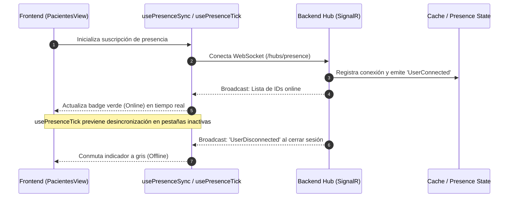

# Gestión de Pacientes y Administración de Usuarios

Módulos administrativos para el registro de pacientes, control de fichas clínicas, monitoreo de presencia en tiempo real con WebSockets (SignalR) y administración de cuentas de usuario con salvaguardas RBAC y avatares dinámicos.

---

## 1. Módulo de Pacientes (`PacientesView.tsx`)

* **Búsqueda Avanzada y Filtros:** Filtrado instantáneo en memoria y paginado por número de documento, nombres, apellidos, estado de actividad o correo.
* **Modos de Vista Dual:**
  - **Vista en Cuadrícula (`PacientesGrid.tsx`):** Tarjetas interactivas con avatares generativos, indicador de estado de conexión (Online / Offline), badge de estado activo y acciones rápidas.
  - **Vista en Tabla (`PacientesTable.tsx`):** Vista densa y estructurada con paginación estandarizada a 8 registros por página y truncamiento inteligente de texto.
* **Exportación CSV Enriquecida:** Exporta la base de pacientes con todos los campos clave (Tipo Documento, Número, Nombre Completo, Teléfono, Correo, Fecha de Nacimiento, Sexo, Estado Activo/Inactivo).
* **Modal de Detalle Rápido (`PacienteDetailModal.tsx`):**
  - Acceso con un clic a la historia clínica, citas agendadas y odontograma del paciente.
  - **Toggle Dinámico de Estado:** Control en un solo clic para alternar el estado del paciente entre *Activo* y *Suspendido/Inactivo* con persistencia inmediata en el backend.

---

## 2. Monitoreo de Presencia en Tiempo Real (`SignalR` & WebSockets)

### Arquitectura de los Hooks de Presencia
* **`usePresenceSync.ts`:** Mantiene la conexión activa con el Hub de SignalR, suscribiéndose a eventos de presencia distribuidos para reflejar altas y bajas de conexión sin refrescar la página.
* **`usePresenceTick.ts`:** Proporciona un latido periódico resiliente que recalcula los tiempos relativos (*"hace 2 min"*, *"hace 1 hora"*) y reengancha la conexión ante microdesconexiones.

---

## 3. Selector Translúcido de Alto Nivel (`GlassSelect.tsx`)

Para solucionar problemas de superposición de menús desplegables nativos con tarjetas de diseño glassmorphism, se implementó el componente `GlassSelect`:
* **Montaje en Portal DOM:** Renderiza el menú flotante en la raíz del body para evitar cortes de `overflow: hidden` o solapamientos con contenedores padres.
* **Z-Index Jerárquico (`z-[9999]`):** Garantiza que las opciones permanezcan siempre legibles y por encima de cualquier capa visual o backdrop blur.
* **Navegación por Teclado y Accesibilidad:** Soporte para flechas de navegación, selector accesible y cierre automático con `Esc` o clic exterior.

---

## 4. Módulo de Usuarios y Seguridad RBAC (`UsuariosView.tsx` / `RolesPermisosView.tsx`)

* **Control de Estado de Cuentas:** Activación y desactivación de usuarios con retroalimentación visual y confirmación obligatoria.
* **Protección Admin Semilla (Root Guard):** El usuario `AD001` (Superadministrador) tiene deshabilitados los botones de desactivación y eliminación para evitar bloqueos del sistema.
* **Blindaje de Auto-Revocación:** En `RolesPermisosView.tsx`, las reglas de negocio impiden que un administrador elimine su propio rol de administración, garantizando la continuidad operativa.
* **Avatares Blobatar:** Integración de avatares geométricos vectoriales animados generados algorítmicamente a partir del identificador o correo del usuario.
