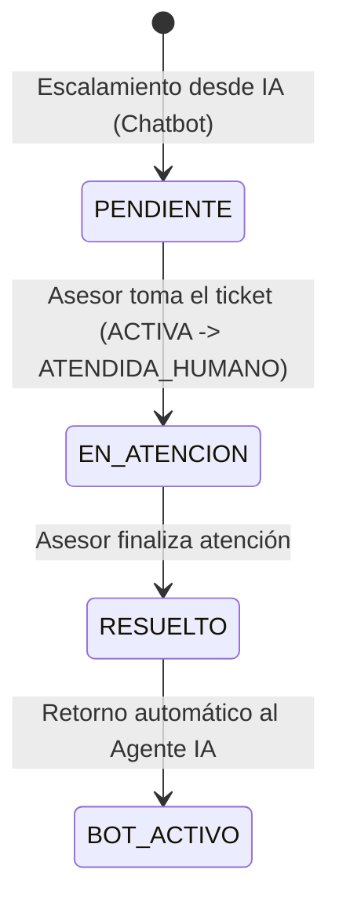

# Flujos de Atención y Chat Asesor Humano

El módulo de **Atención Asesor** (`AtencionAsesorView.tsx`) permite a los agentes y recepcionistas de la clínica odontológica gestionar tickets escalados desde el agente de inteligencia artificial conversacional, interactuando en tiempo real con los pacientes a través de WhatsApp Webhooks y sockets de mensajería.

---

## 1. Ciclo de Vida del Ticket y Transición de Estados

Cuando un paciente solicita atención personalizada o cuando el Agente IA detecta intención compleja de consulta, el ticket transita por la siguiente máquina de estados:



### Matriz de Estados de Conversación

| Estado en Frontend | Estado en Backend .NET | Estado en Agente IA | Descripción Operativa |
| :--- | :--- | :--- | :--- |
| `PENDIENTE` | `TicketStatus.Pending` | `ESCALATED` | En cola de espera para asignación a recepcionista/asesor. |
| `EN_ATENCION` | `TicketStatus.InProgress` | `PAUSED / ATENDIDA_HUMANO` | El bot suspende respuestas automáticas; el humano responde. |
| `RESUELTO` | `TicketStatus.Resolved` | `ACTIVE (returnToBot=true)` | Ticket cerrado; se reactiva el procesamiento de NLP con Gemini. |

---

## 2. Componente Principal: `AtencionAsesorView.tsx`

El componente integra el panel maestro-detalle con filtrado por estado, barra de búsqueda reactiva, visualizador de metadatos del paciente y caja de entrada de mensajes enriquecida.

```tsx
// AtencionAsesorView.tsx - Estructura del flujo de mensajería
import React, { useState, useEffect, useRef } from "react";
import { useTickets, useSendMessage } from "@/hooks/useAtencionAsesor";
import { MessageBubble } from "@/components/chat/MessageBubble";
import { ChatHeader } from "@/components/chat/ChatHeader";
import { PatientQuickProfile } from "@/components/chat/PatientQuickProfile";

export const AtencionAsesorView: React.FC = () => {
  const { activeTicket, messages, isLoading, takeTicket, closeTicket } = useTickets();
  const { sendMessage, isSending } = useSendMessage();
  const [inputText, setInputText] = useState("");
  const messagesEndRef = useRef<HTMLDivElement>(null);

  // Retención de scroll automático al recibir nuevos mensajes
  const scrollToBottom = (smooth = true) => {
    messagesEndRef.current?.scrollIntoView({
      behavior: smooth ? "smooth" : "auto",
      block: "end",
    });
  };

  useEffect(() => {
    scrollToBottom(false);
  }, [activeTicket?.id]);

  useEffect(() => {
    scrollToBottom(true);
  }, [messages.length]);

  const handleSend = async (e: React.FormEvent) => {
    e.preventDefault();
    if (!inputText.trim() || isSending || !activeTicket) return;

    const payload = {
      ticketId: activeTicket.id,
      patientPhone: activeTicket.patientPhone,
      message: inputText.trim(),
      channel: "WHATSAPP",
    };

    await sendMessage(payload);
    setInputText("");
  };

  return (
    <div className="flex h-[calc(100vh-4rem)] bg-slate-900 border border-slate-800 rounded-2xl overflow-hidden shadow-2xl">
      {/* Lista de Tickets en Cola */}
      <aside className="w-80 border-r border-slate-800 bg-slate-950/60 p-4">
        {/* Renderizado de tickets pendientes y activos */}
      </aside>

      {/* Panel Central de Conversación */}
      <main className="flex-1 flex flex-col justify-between bg-slate-900/90">
        <ChatHeader ticket={activeTicket} onCloseTicket={closeTicket} />
        
        <div className="flex-1 overflow-y-auto p-4 space-y-3">
          {messages.map((msg) => (
            <MessageBubble key={msg.id} message={msg} isAdvisor={msg.sender === "ADVISOR"} />
          ))}
          <div ref={messagesEndRef} />
        </div>

        {/* Input con prevención de colisiones */}
        <form onSubmit={handleSend} className="p-4 bg-slate-950/80 border-t border-slate-800 flex gap-2">
          <input
            type="text"
            value={inputText}
            onChange={(e) => setInputText(e.target.value)}
            placeholder="Escribe una respuesta para el paciente..."
            className="flex-1 bg-slate-800 border border-slate-700 rounded-xl px-4 py-2 text-slate-100 placeholder-slate-400 focus:outline-none focus:border-emerald-500"
          />
          <button
            type="submit"
            disabled={isSending || !inputText.trim()}
            className="px-5 py-2 bg-emerald-600 hover:bg-emerald-500 disabled:opacity-50 text-white font-medium rounded-xl transition-all"
          >
            Enviar
          </button>
        </form>
      </main>

      {/* Perfil Rápido del Paciente (Historial, Citas y Alertas) */}
      <PatientQuickProfile patientId={activeTicket?.patientId} />
    </div>
  );
};
```

---

## 3. Integración con el Webhook de WhatsApp (`send-whatsapp`)

Los mensajes enviados por el asesor se despachan a través de la API REST del backend .NET hacia el servicio de mensajería:

> [!IMPORTANT]
> **Aislamiento de Mensajería:** Cuando el asesor toma el ticket (`takeTicket`), el backend emite un webhook interno al bot (`POST /bot/pause-session`) para evitar que el motor de IA responda colateralmente al paciente durante la sesión humana.

```json
// Payload enviado a /api/atencion/send-whatsapp
{
  "ticketId": "TK-84920",
  "patientPhone": "+573001234567",
  "advisorId": "USR-0941",
  "message": "Hola Carlos, te confirmo que tu cita de Ortodoncia ha sido reprogramada para el viernes a las 3:00 PM.",
  "timestamp": "2026-09-16T15:30:00.000Z"
}
```

---

## 4. Retención de Scroll y Manejo de Concurrencia

1. **Auto-Scroll Suave:** La referencia `messagesEndRef` vigila mutaciones en el arreglo de mensajes. Si el usuario está desplazado hacia arriba inspeccionando el historial, el auto-scroll forzado se desactiva hasta que el asesor envíe un nuevo mensaje.
2. **Notificaciones de Nuevos Mensajes:** Si llega un mensaje de WhatsApp mientras el asesor no está en el fondo del chat, se despliega una píldora flotante interactiva indicando `Nuevos mensajes recibidos ↓`.
