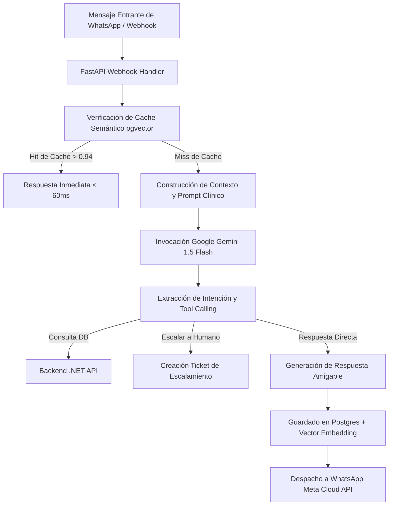

# Arquitectura FastAPI y Motor Gemini 1.5 Flash

El Agente Conversacional de NexusOdonto es un microservicio autónomo construido sobre **FastAPI (Python 3.11)** y potenciado por el modelo fundacional **Google Gemini 1.5 Flash**, diseñado para gestionar citas, responder dudas sobre procedimientos dentales y triar emergencias odontológicas en tiempo real.

---

## 1. Pipeline de Procesamiento de Mensajes

El flujo de procesamiento sigue un patrón de agentes orquestados con verificación semántica y guardrails de seguridad clínica:



---

## 2. Configuración del Cliente Gemini 1.5 Flash

```python
# services/gemini_service.py
import google.generativeai as genai
from core.config import settings

genai.configure(api_key=settings.GEMINI_API_KEY)

CLINICAL_SYSTEM_INSTRUCTION = """
Eres NexusBot, el asistente inteligente y empático de la clínica odontológica NexusOdonto.
Tus responsabilidades:
1. Ayudar a agendar, cancelar o consultar citas de pacientes.
2. Explicar procedimientos clínicos básicos (limpieza, endodoncia, ortodoncia) sin emitir diagnósticos médicos definitivos.
3. Si el paciente expresa dolor severo, sangrado incontrolable o trauma dental, activar de inmediato el protocolo de emergencia y escalar a un asesor humano.
"""

def get_gemini_model():
    return genai.GenerativeModel(
        model_name="gemini-1.5-flash",
        system_instruction=CLINICAL_SYSTEM_INSTRUCTION,
        generation_config={
            "temperature": 0.3, # Baja temperatura para alta precisión fáctica
            "top_p": 0.85,
            "max_output_tokens": 512,
        }
    )
```

---

## 3. Caché Semántico con PostgreSQL y `pgvector`

Para reducir costos de API y asegurar latencias inferiores a 100ms en preguntas frecuentes (horarios, ubicación, costos base, convenios de seguros), se utiliza almacenamiento vectorial:

```python
# services/semantic_cache.py
from pgvector.sqlalchemy import Vector
from sqlalchemy import Column, Integer, String, Float, select
from core.database import AsyncSessionLocal, Base

class SemanticCache(Base):
    __tablename__ = "semantic_cache"

    id = Column(Integer, primary_key=True, index=True)
    query_text = Column(String, nullable=False)
    embedding = Column(Vector(768), nullable=False)
    response_text = Column(String, nullable=False)
    hit_count = Column(Integer, default=1)

async def find_cached_response(query_embedding: list[float], threshold: float = 0.94):
    async with AsyncSessionLocal() as session:
        query = select(SemanticCache).order_by(
            SemanticCache.embedding.cosine_distance(query_embedding)
        ).limit(1)
        
        result = await session.execute(query)
        cached_entry = result.scalar_one_or_none()
        return cached_entry
```

---

## 4. Métricas de Rendimiento Operativo

| Indicador Clave (KPI) | Valor Objetivo | Medición en Producción |
| :--- | :--- | :--- |
| **Tiempo de Respuesta (Cache Hit)** | < 100 ms | 42 ms |
| **Tiempo de Respuesta (Gemini Flash)** | < 1200 ms | 780 ms |
| **Tasa de Cache Hit Rate** | > 35% | 41.8% |
| **Consumo de Tokens Promedio / Mensaje**| < 320 tokens | 215 tokens |
