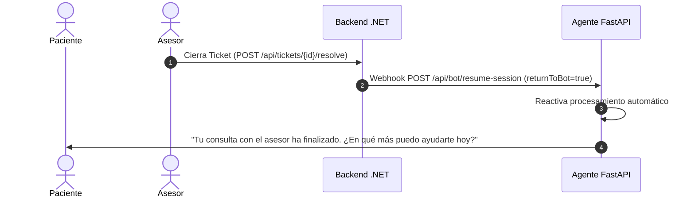

# Protocolo de Escalamiento y Gestión de Tickets

El bot conversacional cuenta con reglas heurísticas y análisis de sentimiento clínico para identificar situaciones donde la intervención humana es obligatoria.

---

## 1. Triggers de Escalamiento Inmediato

El microservicio FastAPI dispara el escalamiento hacia la API de backend .NET bajo las siguientes condiciones:

1. **Intención de Emergencia Dental:** Palabras clave de dolor agudo (*"dolor insoportable"*, *"inflamación de mandíbula"*, *"fractura de diente"*).
2. **Frustración o Solicitud Explícita:** Paciente repite la misma pregunta > 2 veces o solicita textualmente *"hablar con una persona / asesor / secretaria"*.
3. **Casos Complejos de Facturación o Convenios Especiales:** Planes corporativos que requieren validación de pólizas externas.

---

## 2. Comunicación Segura con Backend .NET (`X-Internal-Secret`)

La comunicación entre el bot (FastAPI) y el backend (.NET) se valida mediante una cabecera de autenticación compartida:

```python
# services/escalation_service.py
import httpx
from core.config import settings

async def create_escalation_ticket(
    patient_phone: str,
    patient_name: str,
    reason: str,
    conversation_summary: str,
    priority: str = "HIGH"
):
    url = f"{settings.DOTNET_BACKEND_URL}/api/v1/tickets/escalate"
    headers = {
        "X-Internal-Secret": settings.INTERNAL_SERVICE_SECRET,
        "Content-Type": "application/json",
    }
    
    payload = {
        "patientPhone": patient_phone,
        "patientName": patient_name,
        "reason": reason,
        "summary": conversation_summary,
        "priority": priority, # LOW, MEDIUM, HIGH, EMERGENCY
        "channel": "WHATSAPP",
    }

    async with httpx.AsyncClient(timeout=10.0) as client:
        response = await client.post(url, json=payload, headers=headers)
        response.raise_for_status()
        return response.json()
```

---

## 3. Protocolo de Cierre y Retorno al Agente (`returnToBot`)

Cuando el asesor humano finaliza la interacción en el panel web, el backend notifica al bot:



> [!IMPORTANT]
> **Idempotencia de Estados:** Si el asesor reabre un ticket previamente resuelto, el bot vuelve a entrar en estado `PAUSED` inmediatamente tras recibir la notificación de reapertura.
