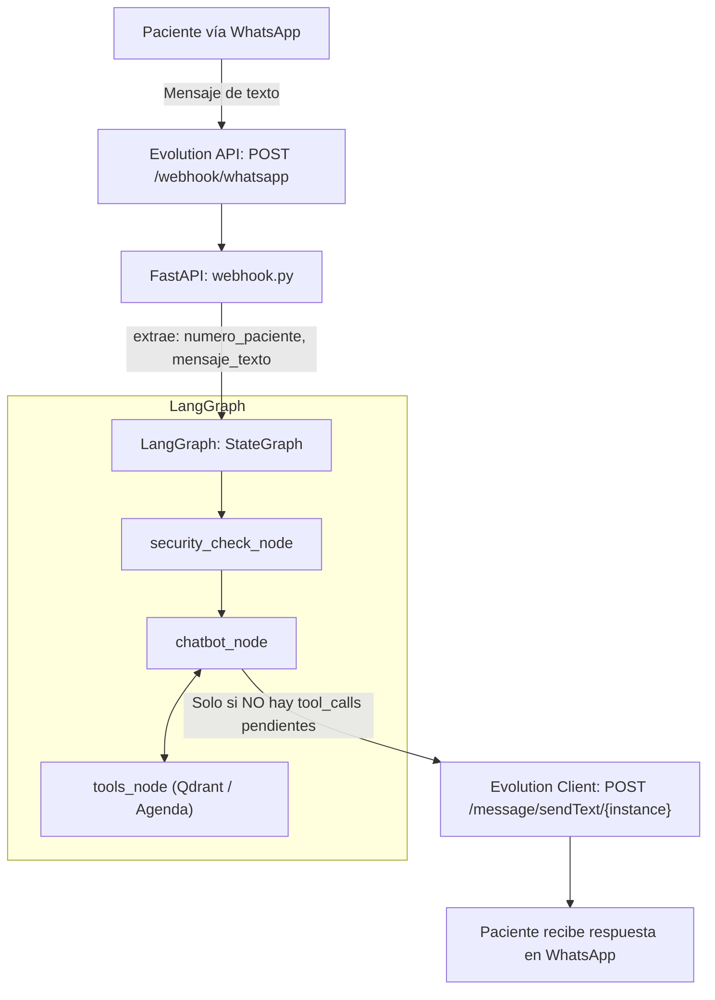

# Documentación Técnica - Día 2

Este documento recopila las especificaciones técnicas y los cambios de integración implementados durante el Día 2, que abarcan el despacho de mensajes a través de la Evolution API, las herramientas de LangChain para el agendamiento con el Backend de .NET Core, y la corrección en la autenticación del Webhook.

---

## 1. Documento de Detalle Técnico: Despacho de Respuestas hacia WhatsApp vía Evolution API

### Resumen Ejecutivo
- **Módulo:** Integración de Mensajería / Agente Conversacional
- **Rama:** `feat/bot-evolution-whatsapp-out`
- **Prioridad:** Alta (Core de Negocio)
- **Objetivo:** Conectar el ciclo final de ejecución de LangGraph con el cliente asíncrono de Evolution API para despachar físicamente las respuestas generadas por el modelo hacia el número de WhatsApp del paciente.

### Arquitectura del Flujo de Datos


### Especificación de Componentes Modificados

*   **[webhook.py](file:///c:/Users/ESSA15/Documents/NexusOdonto_ChatBot_AI/app/api/routes/webhook.py) (Punto de Entrada y Orquestación):**
    *   Deserializa y valida el payload estructurado `EvolutionWebhookPayload`.
    *   Filtra mensajes emitidos por la propia instancia (`fromMe == True`).
    *   Extrae el `remoteJid` del remitente, aislando el número telefónico (`split("@")[0]`) como identificador único de sesión (`thread_id`).
    *   Desencadena la ejecución del grafo de LangGraph de forma asíncrona mediante `await graph.ainvoke()`, inyectando el `thread_id` en el `RunnableConfig`.
    *   Implementa bloque `try/except` de contención para emitir mensaje de fallback (`MENSAJE_FALLBACK_PACIENTE`) en caso de caída del backend de IA o de la base de datos.

*   **[nodes.py](file:///c:/Users/ESSA15/Documents/NexusOdonto_ChatBot_AI/app/graph/nodes.py) (chatbot_node):**
    *   Recibe `config: RunnableConfig` para acceder al contexto configurable (`thread_id`).
    *   Evalúa si la respuesta generada por el LLM (`response`) contiene llamadas a herramientas pendientes (`tool_calls`).
    *   Si la respuesta es texto final y no requiere más ejecuciones intermedias de herramientas, invoca de manera no bloqueante:
        ```python
        await evolution_client.enviar_mensaje(numero=thread_id, texto=texto_respuesta)
        ```

*   **[evolution_client.py](file:///c:/Users/ESSA15/Documents/NexusOdonto_ChatBot_AI/app/clients/evolution_client.py) (Cliente HTTP Asíncrono):**
    *   Encapsula las llamadas HTTP usando `httpx.AsyncClient`.
    *   Realiza `POST` al endpoint `/message/sendText/{instance}` enviando el cuerpo JSON:
        ```json
        {
          "number": "57300XXXXXXX",
          "text": "Respuesta generada por el asistente..."
        }
        ```
    *   Inyecta la cabecera de autenticación `apikey` leída desde las variables de entorno (`EVOLUTION_API_KEY`).

### Matriz de Parámetros y Configuración

| Variable de Entorno | Descripción | Ejemplo de Valor |
| :--- | :--- | :--- |
| `EVOLUTION_API_URL` | URL base del contenedor/servicio de Evolution API | `http://localhost:8080` |
| `EVOLUTION_INSTANCE_NAME` | Identificador de la sesión de WhatsApp activa | `clinica_odonto` |
| `EVOLUTION_API_KEY` | Clave global de autenticación de Evolution API | `<EVOLUTION_API_KEY>` |

### Criterios de Aceptación (DoD) Verificados
*   **Aislamiento de Sesiones:** Cada paciente mantiene su propio contexto de memoria en LangGraph indexado por su número telefónico (`thread_id`).
*   **Supresión de Mensajes Propios:** El bot no entra en bucle recursivo al descartar eventos donde `fromMe: true`.
*   **Entrega Efectiva:** Las respuestas del motor RAG y del asistente conversacional se entregan directamente en el dispositivo móvil del paciente sin truncamiento ni dependencias rotas.

---

## 2. Documento de Detalle Técnico: Herramientas LangChain para Disponibilidad y Agendamiento de Citas

### Resumen Ejecutivo
- **Módulo:** Agente Conversacional / Integración con Backend .NET
- **Rama:** `feat/bot-langchain-tools-agenda`
- **Prioridad:** Alta (Core de Negocio)
- **Objetivo:** Implementar herramientas nativas de LangChain (`@tool`) que interactúen con los endpoints REST del backend en C# (.NET Core) para consultar horarios disponibles y registrar citas médicas con confirmación explícita previa del paciente.

### Arquitectura de Integración e Interacción
```mermaid
graph TD
    P["Paciente en WhatsApp"] --> CB["LangGraph: chatbot_node (GPT-4o)"]
    CB -->|¿Consulta de Horarios?| CD["consultar_disponibilidad_tool"]
    CD -->|GET /api/v1/horarios-disponibles (.NET)| NET[".NET Backend"]
    NET -->|Retorna JSON con turnos disponibles| CD
    CD --> CB
    CB -->|¿Propuesta & Confirmación?| P
    P -->|Confirmación afirmativa explícita| AC["agendar_cita_tool"]
    AC -->|POST /api/v1/citas (.NET)| NET2[".NET Backend / BD"]
```

### Especificación de Componentes Desarrollados

*   **[agenda_tools.py](file:///c:/Users/ESSA15/Documents/NexusOdonto_ChatBot_AI/app/agents/tools/agenda_tools.py) (Definición de Herramientas LangChain):**
    *   `consultar_disponibilidad_tool`:
        *   **Parámetros:** `especialidad: str`, `fecha: str` (formato ISO `YYYY-MM-DD`).
        *   **Operación:** Invoca de forma asíncrona `dotnet_client.consultar_disponibilidad(especialidad, fecha)` contra el endpoint `GET /api/v1/horarios-disponibles`.
        *   **Manejo de Errores:** Retorna mensajes estructurados en caso de error de red o ausencia de cupos para evitar alucinaciones del modelo.
    *   `agendar_cita_tool`:
        *   **Parámetros:** `paciente_telefono: str`, `paciente_nombre: str`, `especialidad: str`, `fecha: str`, `hora: str`, `motivo_consulta: Optional[str]`.
        *   **Operación:** Ejecuta `dotnet_client.agendar_cita(payload)` mediante un `POST /api/v1/citas` enviando el DTO requerido por el backend.
        *   **Retorno:** Serialización JSON del resultado de la reserva con código de confirmación o mensaje de contingencia.

*   **[nodes.py](file:///c:/Users/ESSA15/Documents/NexusOdonto_ChatBot_AI/app/graph/nodes.py) (Inyección de Tools y Prompting de Confirmación):**
    *   **Binding al Modelo:** Se registraron `consultar_disponibilidad_tool` y `agendar_cita_tool` junto a `clinical_knowledge_tool` dentro de `llm.bind_tools(ALL_TOOLS)`.
    *   **Directiva en SYSTEM_MESSAGE:** Se configuró la regla estricta de flujo de dos fases:
        *   **Fase Informativa:** Proponer el resumen específico de la cita (Especialidad, Fecha, Hora y Profesional).
        *   **Fase Ejecutiva:** Solo disparar la herramienta `agendar_cita_tool` si el paciente responde de manera afirmativa explícita a la propuesta.

*   **[builder.py](file:///c:/Users/ESSA15/Documents/NexusOdonto_ChatBot_AI/app/graph/builder.py) (Configuración del Grafo):**
    *   Se inyectó la lista consolidada `ALL_TOOLS` en el `ToolNode("tools")`.
    *   Se mantuvieron los ciclos condicionales estándar mediante `tools_condition` para que el modelo interprete la respuesta del backend antes de emitir la salida a WhatsApp.

### Mapeo de Parámetros y DTOs (.NET Core)

| Parámetro Tool | Campo DTO Backend (.NET) | Tipo de Dato | Descripción |
| :--- | :--- | :--- | :--- |
| `paciente_telefono` | `Telefono` | `string` | Número de WhatsApp extraído del `thread_id` |
| `paciente_nombre` | `Nombre` | `string` | Nombre provisto por el paciente |
| `especialidad` | `Especialidad` | `string` | Servicio odontológico solicitado |
| `fecha` | `Fecha` | `string (YYYY-MM-DD)` | Fecha acordada para el turno |
| `hora` | `Hora` | `string (HH:mm)` | Hora seleccionada |
| `motivo_consulta` | `Motivo` | `string` | Síntoma o descripción general |

### Criterios de Aceptación (DoD) Cumplidos
*   **Consulta Determinista:** Las preguntas sobre disponibilidad retornan únicamente turnos reales reportados por el sistema de base de datos de .NET.
*   **Prevención de Agendamientos Accidentales:** El agente no invoca `agendar_cita_tool` en el primer turno; primero estructura la propuesta y aguarda la confirmación afirmativa del paciente.
*   **Trazabilidad:** Todo intento de reserva o consulta registra logs operativos detallados con el número de teléfono y parámetros consultados.

---

## 3. Documento de Detalle Técnico: Corrección de Autenticación de Webhook y Configuración de Eventos

### Resumen del Cambio
- **Pull Request:** `#44` (`feat/webhook-static-auth-fix`)
- **Tipo:** Corrección de compatibilidad / Seguridad (fix: 🐛)
- **Problema Original:** Evolution API no calcula ni envía firmas criptográficas HMAC nativas en los payloads de webhooks. El middleware anterior intentaba validar una firma HMAC inexistente (`is_valid_webhook_signature`), consumía el stream del body en crudo y rechazaba todas las peticiones legítimas con un `403 Forbidden`. Además, la configuración global de webhooks en Docker generaba conflictos con las instancias individuales.

### Análisis del Problema y Solución Técnica

#### Reemplazo de Validación Criptográfica por Token Estático ([main.py](file:///c:/Users/ESSA15/Documents/NexusOdonto_ChatBot_AI/app/main.py)):
*   Se eliminó el cálculo de firma HMAC y la manipulación manual de bytes del request (`request._receive`).
*   Se implementó validación directa mediante cabeceras estándar (`Authorization` o `apikey`).
*   El middleware ahora verifica si `settings.webhook_secret` coincide con el contenido de las cabeceras antes de permitir el paso al router de FastAPI.

#### Optimización de Ciclo de Lectura del Request ([main.py](file:///c:/Users/ESSA15/Documents/NexusOdonto_ChatBot_AI/app/main.py)):
*   Al no consumir anticipadamente el `request.body()` en el middleware, el flujo de FastAPI puede parsear el JSON de forma nativa en el endpoint `/webhook/whatsapp` sin requerir funciones intermedias de restauración (`restore_request_body`).

#### Ajuste en Orquestación de Contenedores ([docker-compose.yml](file:///c:/Users/ESSA15/Documents/NexusOdonto_ChatBot_AI/docker-compose.yml)):
*   Se desactivó el webhook global (`WEBHOOK_GLOBAL_ENABLED=false`) para avoid despacho redundante o no controlado a nivel de servidor global, permitiendo el control fino de webhooks por instancia.
*   Se estandarizó la variable de entorno `WEBHOOK_GLOBAL_AUTHORIZATION=${WEBHOOK_SECRET:-}` para asegurar consistencia en los tokens de comunicación interna.

### Comparativa de Código (Diff Técnico)

```diff
# En app/main.py - Middleware de validación

- body = await request.body()
- signature = request.headers.get(settings.webhook_signature_header)
- if not is_valid_webhook_signature(body, signature or "", settings.webhook_secret):
-     return JSONResponse(status_code=403, content={"message": "Firma de webhook inválida."})
- request._receive = lambda: restore_request_body(body)

+ auth_header = request.headers.get("Authorization", "")
+ apikey_header = request.headers.get("apikey", "")
+ 
+ if settings.webhook_secret not in auth_header and settings.webhook_secret != apikey_header:
+     logger.warning("Webhook rechazado: token ausente o inválido")
+     return JSONResponse(status_code=403, content={"message": "Token de webhook inválido."})
```

### Impacto en el Sistema
*   **Interoperabilidad:** Desbloqueo total del canal de comunicación entre Evolution API y FastAPI.
*   **Rendimiento:** Reducción de sobrecarga en el middleware al eliminar lectura y clonación duplicada de buffers de memoria (`body`).
*   **Seguridad:** Mantenimiento de la capa de autenticación perimetral contra peticiones no autorizadas mediante tokens secretos configurados en `.env`.
