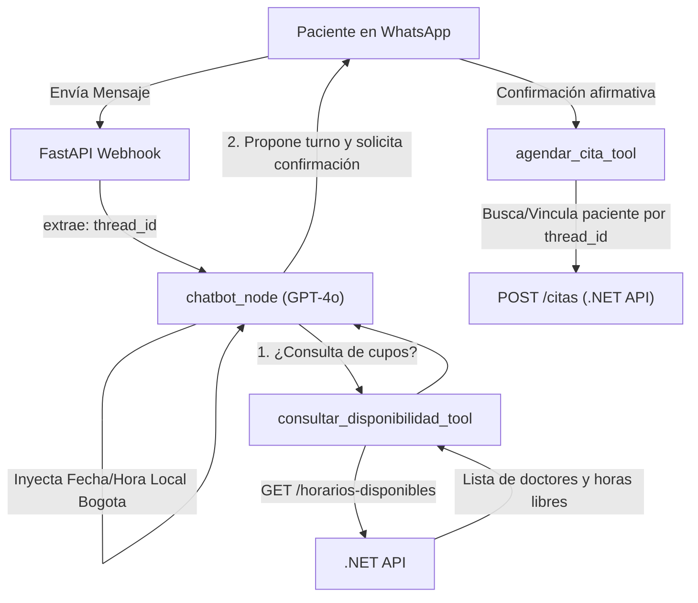

# Documentación Técnica - Día 3

Este documento recopila las especificaciones técnicas, los cambios de infraestructura y la resolución de incidentes implementados durante el Día 3. Abarca el despacho confiable de mensajes vía webhook, la optimización de la imagen Docker (PyTorch CPU), la integración de herramientas de LangChain con la API de C# (.NET Core) en LangGraph, y el procedimiento de recuperación de Evolution API mediante Postman.

---

## 1. Documento de Detalle Técnico: Despacho Confiable de Mensajes vía Webhook y Optimización de Imagen Docker

### Resumen del Cambio
- **Pull Request / Commit:** `#46` (`7accaae`)
- **Tipo:** Corrección de flujo y optimización de infraestructura (fix: 🐛)
- **Problema Original:**
  1. El despacho del mensaje final de WhatsApp dependía de la ejecución interna de `chatbot_node`, lo cual causaba fallos silenciosos o mensajes no enviados cuando el grafo ejecutaba ciclos con herramientas (tools) o terminaba fuera del nodo principal.
  2. El `Dockerfile` descargaba por defecto los paquetes de PyTorch con soporte completo para NVIDIA CUDA (~2.5 GB a 3 GB), ralentizando drásticamente los tiempos de build y engrosando innecesariamente la imagen de Docker para un entorno que solo requiere inferencia CPU.
  3. Desalineación en dependencias de `langchain-core` requeridas para compatibilidad con las últimas características de `langgraph`.

### Análisis de Problemas y Solución Técnica

#### Centralización del Despacho de Respuestas en el Webhook ([webhook.py](file:///c:/Users/ESSA15/Documents/NexusOdonto_ChatBot_AI/app/api/routes/webhook.py)):
*   **Problema:** Asumir que el nodo del grafo despachaba el mensaje impedía tener control centralizado de los estados y capturas de error al finalizar la ejecución completa del grafo compilado.
*   **Solución:** Se delegó la responsabilidad de entrega del mensaje final al webhook tras el `await graph.ainvoke(...)`. El endpoint inspecciona el historial de salida `result.get("messages", [])`, extrae el último `AIMessage` generado y lo despacha de forma segura mediante `await evolution_client.enviar_mensaje(numero_paciente, str(last_message.content))`.
*   Se añadieron registros preventivos (`logger.warning`) en caso de que el mensaje esté vacío o no sea del tipo esperado.

#### Optimización de Instalación de PyTorch CPU ([Dockerfile](file:///c:/Users/ESSA15/Documents/NexusOdonto_ChatBot_AI/Dockerfile)):
*   **Problema:** `pip install torch` descarga drivers CUDA y bibliotecas pesadas de GPU innecesarias para la ejecución en servidor backend estándar.
*   **Solución:** Se añadió un paso de pre-instalación explícito apuntando al repositorio ligero para CPU (`--index-url https://download.pytorch.org/whl/cpu`):
    ```dockerfile
    RUN pip install --no-cache-dir torch --index-url https://download.pytorch.org/whl/cpu
    ```
*   **Resultado:** Reducción de más de un 60% en el peso de la imagen final y aceleración considerable del tiempo de compilación/despliegue en los contenedores.

#### Ajuste de Rango de Versión en Dependencias ([requirements.txt](file:///c:/Users/ESSA15/Documents/NexusOdonto_ChatBot_AI/requirements.txt)):
*   Se actualizó `langchain-core` de una versión anclada fija (`==0.2.35`) a un rango semántico seguro (`>=0.2.38,<0.3.0`) para garantizar compatibilidad con los tipos y manejadores de serialización requeridos por LangGraph 0.2+.

### Comparativa de Código (Diff Técnico)

**Gestión de Salida en [webhook.py](file:///c:/Users/ESSA15/Documents/NexusOdonto_ChatBot_AI/app/api/routes/webhook.py):**

```diff
# Antes: Se asumía despacho dentro del nodo
# El envío de la respuesta ya fue gestionado internamente por el nodo del grafo (chatbot_node)

# Ahora: Validación e inspección explícita del último mensaje del State
+ messages = result.get("messages", [])
+ if messages:
+     last_message = messages[-1]
+     if isinstance(last_message, AIMessage) and last_message.content:
+         await evolution_client.enviar_mensaje(numero_paciente, str(last_message.content))
+     else:
+         logger.warning(f"La última respuesta no es de tipo AIMessage o está vacía: {last_message}")
+ else:
+     logger.warning("No se encontraron mensajes en el resultado del grafo.")
```

### Impacto en el Sistema
*   **Fiabilidad de Entrega:** Asegura que toda respuesta estructurada y contextual producida por el grafo llegue al WhatsApp del paciente independientemente de cuántos saltos o herramientas haya ejecutado internamente.
*   **Eficiencia en CI/CD y Despliegue:** Construcción de contenedores Docker notablemente más rápida y con menor consumo de almacenamiento y memoria RAM.
*   **Estabilidad del Core IA:** Eliminación de inconsistencias entre versiones internas del ecosistema LangChain/LangGraph.

---

## 2. Documento de Detalle Técnico: Implementación de Herramientas de Disponibilidad y Agendamiento en LangGraph

### Resumen del Pull Request
- **PR:** `#47` (`feat/bot-langchain-tools-agenda`)
- **Commit Merge:** `d89fe3c` sobre `develop`
- **Tipo:** Nueva funcionalidad / Core de Negocio (feat)
- **Archivos Modificados:** 4 archivos (+363 / -10 líneas)

### Componentes Implementados y Modificados

*   **[agenda_tools.py](file:///c:/Users/ESSA15/Documents/NexusOdonto_ChatBot_AI/app/agents/tools/agenda_tools.py) (Nuevas Herramientas LangChain):**
    *   **Helper `_run_sync`:** Permite invocar corrutinas asíncronas de forma segura dentro de las tools de LangChain cuando ya existe un event loop de `asyncio` activo en el hilo de ejecución.
    *   `consultar_disponibilidad_tool`:
        *   Recibe `especialidad: str` y `fecha: str` (formato ISO `YYYY-MM-DD`).
        *   Normaliza el texto para buscar tolerante a tildes/mayúsculas contra el catálogo de `GET /especialidades`.
        *   Identifica el servicio y los profesionales vinculados a dicha especialidad (`GET /profesionales`).
        *   Consulta y formatea en texto plano los horarios libres (`GET /horarios-disponibles`) por cada doctor.
    *   `agendar_cita_tool`:
        *   Recibe `profesional_id`, `servicio_id`, `fecha_hora_inicio` (ISO 8601), `motivo_consulta` y el `RunnableConfig` inyectado por LangGraph.
        *   Extrae el `thread_id` (número telefónico de WhatsApp) para buscar o vincular automáticamente al paciente (`/conversaciones-chatbot/{id}/paciente` o `GET /pacientes?search=...`).
        *   Emite la reserva formal vía `POST /citas` con origen `CHATBOT`.

*   **[dotnet_client.py](file:///c:/Users/ESSA15/Documents/NexusOdonto_ChatBot_AI/app/clients/dotnet_client.py) (Ampliación del Cliente HTTP Backend):**
    *   Se implementaron 6 métodos asíncronos para consumir la API de C#:
        1.  `obtener_servicios() -> GET /servicios`
        2.  `obtener_profesionales(especialidad_id) -> GET /profesionales`
        3.  `obtener_especialidades() -> GET /especialidades`
        4.  `obtener_contexto_conversacion(id) -> GET /conversaciones-chatbot/{id}`
        5.  `buscar_pacientes(search) -> GET /pacientes`
        6.  `vincular_paciente(id, paciente_id) -> PATCH /conversaciones-chatbot/{id}/paciente`

*   **[nodes.py](file:///c:/Users/ESSA15/Documents/NexusOdonto_ChatBot_AI/app/graph/nodes.py) & [builder.py](file:///c:/Users/ESSA15/Documents/NexusOdonto_ChatBot_AI/app/graph/builder.py):**
    *   **Binding de Tools:** Se vincularon `consultar_disponibilidad_tool` y `agendar_cita_tool` junto a `clinical_knowledge_tool` dentro del LLM y en el nodo ejecutor `ToolNode`.
    *   **Inyección de Contexto Temporal Dinámico:** En cada invocación de `chatbot_node`, se inyecta un `SystemMessage` con la fecha, día de la semana y hora local calculada (`America/Bogota`), permitiendo al modelo resolver referencias relativas como "este viernes" o "mañana por la tarde".
    *   **Restricción de Flujo en Prompt:** Se forzó la regla de que el modelo nunca invoque `agendar_cita_tool` sin presentar primero la propuesta estructurada (Doctor, Especialidad, Fecha y Hora) y obtener la confirmación explícita del paciente.

### Diagrama de Ejecución



### Criterios de Aceptación (DoD) Alcanzados
*   Las consultas sobre horarios retornan datos en tiempo real consultados en la base de datos de .NET.
*   El modelo calcula fechas relativas con precisión usando la zona horaria del consultorio.
*   Se previene el agendamiento involuntario al forzar confirmación previa en el prompt del sistema.

---

## 3. Documento de Incidente y Resolución Técnica: Recuperación y Reconfiguración de Instancia Evolution API mediante Postman

### Resumen del Incidente
- **Tipo:** Incidente de Conectividad / Gateway de WhatsApp
- **Herramienta de Diagnóstico y Recuperación:** Postman (Workspace de Integraciones)
- **Componente Afectado:** `evolution-api` (Módulo Baileys)
- **Síntoma:** El chatbot dejó de emitir respuestas por WhatsApp. Los logs de FastAPI no registraban llamadas entrantes en el endpoint `/webhook/whatsapp`.
- **Causa Raíz:** Desconexión de la sesión activa entre Baileys y los servidores de WhatsApp, dejando la instancia en estado inoperativo (`close`) y desvinculando la entrega de eventos hacia el webhook de la aplicación.

### Diagnóstico en Postman
Se ejecutó la petición de diagnóstico:
- **Método:** `GET`
- **URL:** `http://localhost:8080/instance/fetchInstances`
- **Header:** `apikey: <EVOLUTION_API_KEY>`
- **Resultado:** La instancia `clinica_odonto` no reportaba conexión activa (`connectionStatus: "close"`), confirmando la interrupción del servicio de mensajería.

### Procedimiento de Resolución y Reaprovisionamiento (Paso a Paso en Postman)

#### Paso 1: Eliminar la instancia huérfana
- **Método:** `DELETE`
- **URL:** `http://localhost:8080/instance/delete/clinica_odonto`
- **Headers:**
  - `apikey: <EVOLUTION_API_KEY>`
- **Respuesta esperada:** `200 OK` (Instancia eliminada del registro de Evolution).

#### Paso 2: Crear la nueva instancia con vinculación directa de Webhook
- **Método:** `POST`
- **URL:** `http://localhost:8080/instance/create`
- **Headers:**
  - `Content-Type: application/json`
  - `apikey: <EVOLUTION_API_KEY>`
- **Body (raw JSON):**
  ```json
  {
    "instanceName": "clinica_odonto",
    "token": "<EVOLUTION_API_KEY>",
    "qrcode": true,
    "integration": "WHATSAPP-BAILEYS",
    "webhook": {
      "url": "http://agente-python:8000/webhook/whatsapp",
      "enabled": true,
      "events": [
        "MESSAGES_UPSERT"
      ]
    }
  }
  ```
- **Respuesta esperada:** `201 Created` con los metadatos de la instancia configurada.

#### Paso 3: Obtener el Código QR para reconexión
- **Método:** `GET`
- **URL:** `http://localhost:8080/instance/connect/clinica_odonto`
- **Headers:**
  - `apikey: <EVOLUTION_API_KEY>`
- **Acción realizada:** Se escaneó el código QR devuelto en la respuesta desde la aplicación de WhatsApp en el dispositivo móvil para autenticar la sesión.

### Verificación y Pruebas de Cierre (DoD)
*   **Estado de Conexión:** Se verificó vía `GET /instance/connectionState/clinica_odonto` que el estado cambiara a `"open"`.
*   **Prueba End-to-End:** Se envió un mensaje de texto de prueba desde WhatsApp, validando que Evolution API despachó el payload a `POST http://agente-python:8000/webhook/whatsapp` y el paciente recibió la respuesta del bot con normalidad.
