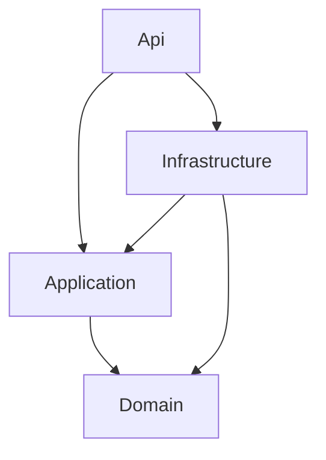

# Trabajo backend — 25 de agosto de 2026

**Autor:** Alejandro Escobar  
**Fecha:** 2026-08-25 (martes)

Documentación del avance realizado en **NexusOdontoBackend_Api** durante el martes 25 de agosto de 2026, basada en el historial de git (`git log --since="2026-08-25" --until="2026-08-26" --all`) y en el contexto de desarrollo del equipo.

---

## Resumen ejecutivo

El martes se levantó la **base completa del backend** con arquitectura en capas (Api → Application → Domain → Infrastructure). El equipo integró en `develop` **14 pull requests** (#16–#29) que cubren:

- Fundamentos de dominio y contratos (`BaseEntity`, `IUnitOfWork`, `IRepository<T>`)
- Manejo global de errores y clientes HTTP resilientes
- Módulo de **seguridad**: entidades, value objects, autenticación JWT, CRUD de usuarios y autorización por permisos
- Módulo **clínico**: entidades, DTOs, validadores, servicios transaccionales y controllers REST
- Migración de identificadores de `long` a **`Guid`**
- **Infraestructura EF Core + Oracle** con patrón Unit of Work (contribución principal de Alejandro Escobar)

---

## Qué se hizo

### 1. Arquitectura base

| Commit    | Autor       | Descripción                                     |
| --------- | ----------- | ----------------------------------------------- |
| `a36c3ce` | corredor29  | `BaseEntity` abstracta e interfaz `IUnitOfWork` |
| PR #16    | Corredor_29 | Merge `feat/core-arquitectura-base`             |

- Se eliminaron clases placeholder (`Class1.cs`) de Domain y Application.
- `BaseEntity` centraliza `Id`, fechas de auditoría (`FechaCreacion`, `FechaActualizacion`) y flag `Activo`.
- `IUnitOfWork` define persistencia y transacciones (`SaveChangesAsync`, begin/commit/rollback).

### 2. Resiliencia y manejo de errores

| Commit    | Autor       | Descripción                                         |
| --------- | ----------- | --------------------------------------------------- |
| `6132900` | corredor29  | Middleware global de excepciones + HTTP resilientes |
| PR #17    | Corredor_29 | Merge `feat/api-error-resilience`                   |

**Archivos creados:**

- `Api/Middleware/GlobalExceptionMiddleware.cs` — captura excepciones y responde JSON consistente.
- `Api/Extensions/AppExtensions.cs` — extensión `UseGlobalExceptionMiddleware()` y registro de clientes HTTP resilientes.
- `Application/Exceptions/ValidationException.cs` (400) y `NotFoundException.cs` (404).
- Integración de **Serilog** en `Api/Program.cs`.

### 3. Seguridad — dominio y autenticación

| Commit                | Autor      | Descripción                                            |
| --------------------- | ---------- | ------------------------------------------------------ |
| `4faed42`             | Sergio0973 | Entidades `Usuario`, `Rol`, `Permiso` + value objects  |
| `e3ed5f4`             | Sergio0973 | `AuthService` con JWT, registro y login                |
| `b7d8787`             | Sergio0973 | Controllers `AuthController` y `UsuariosController`    |
| `ee58c80`             | Sergio0973 | `RequirePermissionAttribute` para autorización por rol |
| PR #18, #20, #22, #27 | —          | Merges de ramas de seguridad                           |

**Entidades de dominio:**

| Entidad   | Responsabilidad                                                                |
| --------- | ------------------------------------------------------------------------------ |
| `Usuario` | Credenciales, rol, métodos de dominio (`CambiarNombre`, `CambiarCorreo`, etc.) |
| `Rol`     | Nombre y colección de permisos                                                 |
| `Permiso` | Módulo al que aplica un permiso                                                |

**Value objects:** `Correo`, `NombreUsuario`, `NombreRol`, `PasswordHash`, `ModuloPermiso`.

**Servicio de autenticación (`AuthService`):**

- Hash de contraseñas con **BCrypt**.
- Generación de JWT con claims `sub` (userId), `rolId`, `role`.
- DTOs: `LoginRequestDto`, `RegisterRequestDto`, `AuthResponseDto`, `UsuarioResponseDto`.
- Contratos: `IAuthService`, `IUsuarioRepository`, `IRepository<T>`, `JwtSettings`.

**Endpoints REST de seguridad:**

| Método  | Ruta                            | Auth      | Descripción                      |
| ------- | ------------------------------- | --------- | -------------------------------- |
| `POST`  | `/api/auth/login`               | Público   | Login, devuelve JWT              |
| `POST`  | `/api/usuarios`                 | Requerido | Crear usuario                    |
| `GET`   | `/api/usuarios`                 | Requerido | Listar usuarios con rol          |
| `PUT`   | `/api/usuarios/{id}`            | Requerido | Editar nombre, correo y rol      |
| `PATCH` | `/api/usuarios/{id}/desactivar` | Requerido | Desactivar usuario (soft delete) |

### 4. Módulo clínico

| Commit                     | Autor    | Descripción                                                      |
| -------------------------- | -------- | ---------------------------------------------------------------- |
| `f18ca94`                  | Dxnxxl06 | Entidades `Persona`, `Paciente`, `Profesional`, `Servicio`       |
| `ae46a7d`                  | Dxnxxl06 | DTOs, validadores FluentValidation y mapeo Mapster               |
| `47210fb`                  | Dxnxxl06 | `PacienteService` y `ProfesionalService` con flujo transaccional |
| `6fdf448`                  | Dxnxxl06 | `PacientesController` y `ServiciosController` bajo `/api/v1`     |
| PR #21, #24, #26, #28, #29 | —        | Merges de ramas clínicas                                         |

**Entidades:**

| Entidad       | Campos principales                                                         |
| ------------- | -------------------------------------------------------------------------- |
| `Persona`     | Documento, nombres, apellidos, fecha nacimiento, sexo, contacto, dirección |
| `Paciente`    | `PersonaId`, contacto y teléfono de emergencia                             |
| `Profesional` | `EmpleadoId`, registro profesional                                         |
| `Servicio`    | Código, nombre, descripción, duración, precio, orden                       |

**Capa de aplicación clínica:**

- DTOs: `CrearPacienteRequestDto`, `CrearServicioRequestDto`.
- Validadores: `CrearPacienteRequestDtoValidator`, `CrearServicioRequestDtoValidator`.
- Mapeo: `ClinicalMappingRegister` (Mapster).
- Servicios con transacciones explícitas (`BeginTransactionAsync` / `Commit` / `Rollback`).
- Controllers REST versionados en `/api/v1`.

### 5. Migración de identificadores a Guid

| Commit    | Autor      | Descripción                                                            |
| --------- | ---------- | ---------------------------------------------------------------------- |
| `fd926a2` | Sergio0973 | Reemplazo de `long` por `Guid` en entidades, DTOs, repos y controllers |
| `fb4d886` | Dxnxxl06   | Ajuste de `Guid` en entidades clínicas                                 |
| PR #23    | Sergio0973 | Merge `fix/guid-identifiers`                                           |

Alcance: `BaseEntity.Id`, foreign keys (`RolId`, `PersonaId`, etc.), parámetros de ruta `{id:guid}` y contratos de repositorio.

### 6. Infraestructura — EF Core, Swagger y Oracle *(Alejandro Escobar)*

| Commit    | Hora  | Descripción                                                                          |
| --------- | ----- | ------------------------------------------------------------------------------------ |
| `7e938dd` | 10:31 | Swagger + servicios de infraestructura + `AppDbContext` + `UnitOfWork` |
| `2c4c44e` | 10:32 | Merge PR #19 (`Infra-AppDbContext`)                                                  |
| `ed3b7ed` | 14:05 | Conexión Oracle + refactor UnitOfWork                                                |
| `95a801c` | 14:06 | Merge PR #25 (`Infra-AppDbContext`)                                                  |

**Qué se implementó:**

| Componente            | Ubicación                                    | Detalle                                                         |
| --------------------- | -------------------------------------------- | --------------------------------------------------------------- |
| `AppDbContext`        | `Infrastructure/Data/Context/AppDbContex.cs` | EF Core con `ApplyConfigurationsFromAssembly`                   |
| `DependencyInjection` | `Infrastructure/DependencyInjection.cs`      | `AddInfrastructure()` registra DbContext Oracle y `IUnitOfWork` |
| `UnitOfWork`          | `Infrastructure/UnitOfWorks/UnitOfWork.cs`   | Implementación con transacciones explícitas                     |
| Swagger               | `Api/Program.cs`                             | `AddSwaggerGen()` + `UseSwagger()` en Development               |
| Connection string     | `Api/appsettings.json`                       | Plantilla `OracleConnection` para Oracle XE/PDB                 |

**Registro en `Program.cs`:**

```csharp
builder.Services.AddSwaggerGen();
builder.Services.AddInfrastructure(builder.Configuration);
```

**Operaciones de `UnitOfWork`:**

| Método                       | Comportamiento                                  |
| ---------------------------- | ----------------------------------------------- |
| `SaveChangesAsync()`         | Persiste cambios del contexto                   |
| `BeginTransactionAsync()`    | Inicia transacción (error si ya hay una activa) |
| `CommitTransactionAsync()`   | Confirma y libera la transacción                |
| `RollbackTransactionAsync()` | Revierte y libera la transacción                |

**Correcciones en el segundo commit (`ed3b7ed`):**

- Connection string unificada bajo `OracleConnection` (antes mezclaba `Default` y `OracleConnection`).
- Registro DI corregido: `AddScoped<IUnitOfWork, UnitOfWork>()` (antes registraba la interfaz contra sí misma).
- `UnitOfWork` movido de `Infrastructure/UnitOfWork/` a `Infrastructure/UnitOfWorks/`.
- `IRepository<TEntity>` renombrado genérico para consistencia.

---

## Por qué

| Tema                             | Motivación                                                                                                                     |
| -------------------------------- | ------------------------------------------------------------------------------------------------------------------------------ |
| **Arquitectura en capas**        | Separar presentación, casos de uso, dominio e infraestructura para mantener dependencias unidireccionales y facilitar pruebas. |
| **Middleware global**            | Respuestas de error uniformes (`status`, `message`, `details`) sin repetir try/catch en cada controller.                       |
| **JWT + BCrypt**                 | Autenticación stateless estándar para API REST; hash seguro de contraseñas.                                                    |
| **Guid como PK**                 | Identificadores únicos distribuibles, alineados con Oracle y evitando colisiones en entornos multi-instancia.                  |
| **Unit of Work + transacciones** | Operaciones clínicas compuestas (ej. crear `Persona` + `Paciente`) requieren atomicidad.                                       |
| **Oracle + EF Core**             | Base de datos objetivo del proyecto; `AppDbContext` centraliza el modelo relacional.                                           |
| **Swagger en Development**       | Documentación interactiva de endpoints mientras el módulo crece.                                                               |
| **RequirePermissionAttribute**   | Autorización declarativa por módulo/acción en lugar de lógica ad hoc en controllers.                                           |

---

## Detalles técnicos

### Arquitectura del proyecto

```
NexusOdontoBackend_Api/
├── Api/                  # Controllers, middleware, Program.cs
├── Application/          # DTOs, contratos, servicios, validadores
├── Domain/               # Entidades, value objects
└── Infrastructure/       # EF Core, DbContext, UnitOfWork, DI
```

### Flujo de dependencias



### Modelo de dominio al cierre del martes

```
BaseEntity (abstract)
├── Usuario          → Rol (N:1)
├── Rol              → Permiso (N:M)
├── Permiso
├── Persona          → Paciente (1:1 opcional)
├── Paciente         → Persona (N:1)
├── Profesional
└── Servicio
```

### Pull requests mergeados el martes

| PR  | Rama                               | Contenido                              |
| --- | ---------------------------------- | -------------------------------------- |
| #16 | `feat/core-arquitectura-base`      | `IUnitOfWork` + `BaseEntity`           |
| #17 | `feat/api-error-resilience`        | Middleware global + HTTP resilientes   |
| #18 | `feat/security-entities`           | Entidades y value objects de seguridad |
| #19 | `Infra-AppDbContext`               | Swagger + infraestructura EF Core      |
| #20 | `feat/security-auth-service`       | `AuthService` con JWT                  |
| #21 | `feat/clinical-sql-entities`       | Entidades clínicas                     |
| #22 | `feat/security-controllers`        | Controllers Auth y Usuarios            |
| #23 | `fix/guid-identifiers`             | Migración `long` → `Guid`              |
| #24 | `feat/clinical-sql-entities`       | Ajustes Guid en entidades clínicas     |
| #25 | `Infra-AppDbContext`               | Conexión Oracle + UnitOfWork           |
| #26 | `feat/clinical-dtos-validators`    | DTOs, validadores y Mapster            |
| #27 | `feat/security-dynamic-roles`      | `RequirePermissionAttribute`           |
| #28 | `feat/clinical-composite-services` | Servicios transaccionales clínicos     |
| #29 | `feat/clinical-rest-endpoints`     | Controllers Pacientes y Servicios      |

### Stack tecnológico utilizado

| Tecnología                                 | Uso                  |
| ------------------------------------------ | -------------------- |
| .NET 10                                    | Runtime y SDK        |
| ASP.NET Core                               | Web API              |
| Entity Framework Core 10 + Oracle provider | Persistencia         |
| JWT Bearer                                 | Autenticación        |
| BCrypt.Net                                 | Hash de contraseñas  |
| Serilog                                    | Logging estructurado |
| Swagger / OpenAPI                          | Documentación de API |
| FluentValidation                           | Validación de DTOs   |
| Mapster                                    | Mapeo entidad ↔ DTO  |

### Configuración requerida para ejecutar (estado al 25/08)

1. **Oracle Database** accesible en el host configurado.
2. Connection string en `appsettings.json` o variables de entorno:

```
User Id=TU_USUARIO;Password=TU_CONTRASENA;Data Source=localhost:1521/XEPDB1
```

3. Variables JWT configuradas (mínimo 32 bytes en `SigningKey`).
4. Ejecutar desde `Api/`: `dotnet run`
5. Swagger en desarrollo: `https://localhost:<puerto>/swagger`

---

## Pendiente

Basado en el estado del código al cierre del martes y en trabajo posterior identificado en el historial:

- [ ] Configuraciones EF Core (Fluent API) para entidades clínicas y de seguridad
- [ ] Implementar repositorios concretos en Infrastructure (solo existían contratos)
- [ ] Registrar `AuthService`, `IUsuarioRepository` y servicios clínicos en DI
- [ ] Configurar middleware JWT (`AddAuthentication` / `AddJwtBearer`) en `Program.cs`
- [ ] Agregar migraciones EF Core contra Oracle
- [ ] Crear archivo `.env.example` con variables requeridas
- [ ] Refactorizar `UsuariosController` para usar un `IUsuarioService` (mutaciones fuera del dominio)
- [ ] Renombrar `Paciente.update()` → `Actualizar()` por convención del dominio

> **Nota:** Algunos cambios locales iniciados el martes (carga de `.env` con DotNetEnv, mejoras en `BaseEntity` y `Paciente`) se commitearon el **26/08** (`75a31ae`, `1818455`). El refactor de carpetas de DTOs clínicos también quedó para el **26/08** (`7dd3af5`).

---

## Fuentes

| Fuente                    | Detalle                                                                     |
| ------------------------- | --------------------------------------------------------------------------- |
| Git log martes            | `git log --since="2026-08-25" --until="2026-08-26" --all` — 30 commits      |
| Commits Alejandro Escobar | `7e938dd` (10:31), `ed3b7ed` (14:05), merges PR #19 y #25                   |
| PRs mergeados             | #16 al #29                                                                  |
| Documentación relacionada | `docs/application-contracts-repositories.md` (contratos posteriores, 27/08) |
| Transcript de sesión      | Documentación previa del 25/08 en historial de chat                         |

---

*Documentado por Alejandro Escobar — 25/08/2026*


documentacion martes
