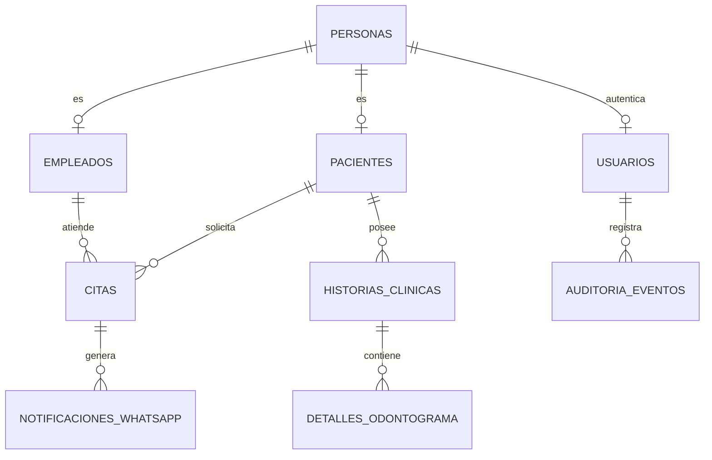

# Esquema Oracle DDL, Tablas y Restricciones

El motor de persistencia central de **NexusOdonto** opera sobre **Oracle Database 19c / 23ai**, estructurado en Tercera Forma Normal (3FN) con soporte para alta concurrencia, auditoría automática y aislamiento de registros clínicos.

---

## 1. Diagrama de Relaciones Principales



---

## 2. Script DDL de Tablas Principales (PL/SQL)

### 2.1 Tablas de Identidad y Usuarios

```sql
-- 1. PERSONAS (Datos demográficos universales)
CREATE TABLE PERSONAS (
    ID NUMBER GENERATED BY DEFAULT AS IDENTITY PRIMARY KEY,
    TIPO_DOCUMENTO VARCHAR2(10) NOT NULL CHECK (TIPO_DOCUMENTO IN ('CC', 'TI', 'CE', 'PAS', 'PEP')),
    NUMERO_DOCUMENTO VARCHAR2(25) NOT NULL UNIQUE,
    PRIMER_NOMBRE VARCHAR2(60) NOT NULL,
    SEGUNDO_NOMBRE VARCHAR2(60),
    PRIMER_APELLIDO VARCHAR2(60) NOT NULL,
    SEGUNDO_APELLIDO VARCHAR2(60),
    FECHA_NACIMIENTO DATE NOT NULL,
    GENERO VARCHAR2(20) CHECK (GENERO IN ('MASCULINO', 'FEMENINO', 'OTRO', 'NO_REPORTA')),
    TELEFONO VARCHAR2(20) NOT NULL,
    EMAIL VARCHAR2(120) NOT NULL,
    DIRECCION VARCHAR2(200),
    FECHA_CREACION TIMESTAMP WITH LOCAL TIME ZONE DEFAULT CURRENT_TIMESTAMP NOT NULL
);

-- 2. USUARIOS (Credenciales de autenticación y RBAC)
CREATE TABLE USUARIOS (
    ID NUMBER GENERATED BY DEFAULT AS IDENTITY PRIMARY KEY,
    PERSONA_ID NUMBER NOT NULL UNIQUE,
    USERNAME VARCHAR2(60) NOT NULL UNIQUE,
    PASSWORD_HASH VARCHAR2(255) NOT NULL,
    ROL_CODIGO VARCHAR2(20) NOT NULL CHECK (ROL_CODIGO IN ('ADMIN', 'ODONTOLOGO', 'RECEPCIONISTA', 'PACIENTE')),
    ESTADO VARCHAR2(20) DEFAULT 'ACTIVO' CHECK (ESTADO IN ('ACTIVO', 'BLOQUEADO', 'INACTIVO')),
    ULTIMO_ACCESO TIMESTAMP WITH LOCAL TIME ZONE,
    CONSTRAINT FK_USUARIOS_PERSONA FOREIGN KEY (PERSONA_ID) REFERENCES PERSONAS(ID) ON DELETE CASCADE
);
```

---

### 2.2 Tablas Clínicas y Odontograma

```sql
-- 3. PACIENTES
CREATE TABLE PACIENTES (
    ID NUMBER GENERATED BY DEFAULT AS IDENTITY PRIMARY KEY,
    PERSONA_ID NUMBER NOT NULL UNIQUE,
    GRUPO_SANGUINEO VARCHAR2(5) CHECK (GRUPO_SANGUINEO IN ('A+', 'A-', 'B+', 'B-', 'AB+', 'AB-', 'O+', 'O-')),
    ALERGIAS_MEDICAS CLOB,
    ANTECEDENTES_PATOLOGICOS CLOB,
    CONTACTO_EMERGENCIA_NOMBRE VARCHAR2(120),
    CONTACTO_EMERGENCIA_TELEFONO VARCHAR2(20),
    CONSTRAINT FK_PACIENTES_PERSONA FOREIGN KEY (PERSONA_ID) REFERENCES PERSONAS(ID)
);

-- 4. HISTORIAS_CLINICAS
CREATE TABLE HISTORIAS_CLINICAS (
    ID NUMBER GENERATED BY DEFAULT AS IDENTITY PRIMARY KEY,
    PACIENTE_ID NUMBER NOT NULL,
    ODONTOLOGO_ID NUMBER NOT NULL,
    NUMERO_EXPEDIENTE VARCHAR2(30) NOT NULL UNIQUE,
    MOTIVO_CONSULTA VARCHAR2(500) NOT NULL,
    DIAGNOSTICO_CIE10 VARCHAR2(20),
    PLAN_TRATAMIENTO CLOB,
    FECHA_ATENCION TIMESTAMP WITH LOCAL TIME ZONE DEFAULT CURRENT_TIMESTAMP NOT NULL,
    CONSTRAINT FK_HC_PACIENTE FOREIGN KEY (PACIENTE_ID) REFERENCES PACIENTES(ID)
);

-- 5. DETALLES_ODONTOGRAMA (5 superficies por diente FDI)
CREATE TABLE DETALLES_ODONTOGRAMA (
    ID NUMBER GENERATED BY DEFAULT AS IDENTITY PRIMARY KEY,
    HISTORIA_CLINICA_ID NUMBER NOT NULL,
    NUMERO_DIENTE NUMBER(2) NOT NULL CHECK (NUMERO_DIENTE BETWEEN 11 AND 85),
    SUPERFICIE VARCHAR2(20) NOT NULL CHECK (SUPERFICIE IN ('VESTIBULAR', 'LINGUAL', 'MESIAL', 'DISTAL', 'OCLUSAL', 'GENERAL')),
    ESTADO_CONDICION VARCHAR2(50) NOT NULL CHECK (ESTADO_CONDICION IN ('SANO', 'CARIES', 'OBTURADO', 'CORONA', 'ENDODONCIA', 'AUSENTE', 'IMPLANTE')),
    NOTAS VARCHAR2(300),
    FECHA_REGISTRO TIMESTAMP WITH LOCAL TIME ZONE DEFAULT CURRENT_TIMESTAMP NOT NULL,
    CONSTRAINT FK_ODONTO_HC FOREIGN KEY (HISTORIA_CLINICA_ID) REFERENCES HISTORIAS_CLINICAS(ID)
);
```

---

## 3. Integridad Referencial y Reglas de Negocio

> [!IMPORTANT]
> **Aislamiento por Paciente:** Cada detalle de odontograma e historia clínica está estrictamente encapsulado por `PACIENTE_ID` para asegurar cumplimiento con normativas de protección de datos de salud (Ley Estatutaria de Salud 1751 / HIPAA compliance).
