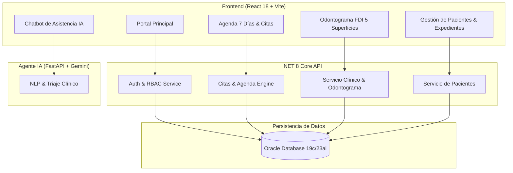

# Bienvenido al Ecosistema NexusOdonto

**NexusOdonto** es una plataforma integral de grado empresarial diseñada para la gestión clínica, administrativa y asistencial de clínicas odontológicas modernas. Desarrollada sobre una arquitectura escalable, segura y modular, combina la potencia de **.NET 8**, **Oracle Database**, interfaces interactivas en **React 18** y asistencia diagnóstica impulsada por **Inteligencia Artificial (Google Gemini)**.

---

## 🎯 Objetivos Estratégicos del Proyecto

1. **Digitalización y Trazabilidad Odontológica**: Reemplazar expedientes físicos por un historial clínico digital centralizado, seguro y auditable.
2. **Odontograma FDI Interactivo de 5 Superficies**: Interfaz gráfica dinámica que permite a los profesionales registrar patologías, restauraciones y planes de tratamiento con retroalimentación visual inmediata.
3. **Agenda Inteligente y Control de Capacidad**: Gestión de citas en tiempo real (zona horaria Colombia UTC-5), prevención automática de colisiones horarias por paciente y control de concurrencia médica.
4. **Seguridad Robusta y Control de Acceso (RBAC)**: Segregación rigurosa de funciones mediante roles canónicos (`AD001` Administrador, `OD001` Odontólogo, `RC001` Recepcionista), tokens JWT y autenticación federada con Google OAuth.
5. **Triaje Automatizado y Soporte con IA**: Agente conversacional inteligente que asiste a los pacientes en la clasificación preliminar de motivos de consulta y resolución de dudas.

---

## 🏛️ Arquitectura y Stack Tecnológico

La plataforma está diseñada siguiendo los principios de **Clean Architecture**, separación de responsabilidades y despliegue contenerizado:

| Capa / Componente | Tecnología | Responsabilidad Principal |
| :--- | :--- | :--- |
| **Frontend Web SPA** | React 18, TypeScript, Vite, Tailwind CSS, Motion/React | Interfaz de usuario interactiva, odontograma gráfico, agenda responsiva y panel de administración. |
| **Backend API Core** | .NET 8, C#, Clean Architecture, CQRS, EF Core | Servicios RESTful, validaciones de dominio, persistencia transaccional y seguridad JWT. |
| **Base de Datos** | Oracle Database 19c / 23ai Enterprise + Cache Semántica | Almacenamiento relacional de alta disponibilidad, integridad referencial y procedimientos optimizados. |
| **Microservicio IA** | Python 3.11, FastAPI, Google Gemini 1.5 Pro | Agente conversacional para triaje médico, clasificación de intenciones y análisis clínico asistido. |
| **DevOps & Infraestructura** | Docker Compose, Nginx Reverse Proxy, GitHub Actions | Contenerización multi-servicio, enrutamiento seguro con HTTPS y pipeline de CI/CD automatizado. |

---

## 🧩 Diagrama de Flujo del Ecosistema



---

## 💻 Estructura del Modelo de Dominio (Entidades de Ejemplo)

A continuación se muestra un extracto representativo del modelo clínico implementado en el backend:

```csharp
namespace NexusOdonto.Core.Domain.Entities
{
    /// <summary>
    /// Entidad de dominio que representa a un paciente en NexusOdonto.
    /// </summary>
    public class Paciente
    {
        public Guid Id { get; set; } = Guid.NewGuid();
        public required string NumeroDocumento { get; set; }
        public required string TipoDocumento { get; set; } // CC, TI, CE, Pasaporte
        public required string Nombres { get; set; }
        public required string Apellidos { get; set; }
        public DateTime FechaNacimiento { get; set; }
        public string? Telefono { get; set; }
        public string? Email { get; set; }
        
        // Relaciones Clínicas
        public ICollection<CitaMedica> Citas { get; set; } = new List<CitaMedica>();
        public ICollection<OdontogramaRegistro> Odontogramas { get; set; } = new List<OdontogramaRegistro>();
        public ICollection<EvolucionClinica> Evoluciones { get; set; } = new List<EvolucionClinica>();

        public DateTime CreadoEn { get; set; } = DateTime.UtcNow;
        public bool Activo { get; set; } = true;
    }
}
```

---

## 🗺️ Mapa de Navegación de la Documentación

Utilice el menú lateral para consultar cada especificación detallada:

* **[01. Arquitectura y Entorno](/docs/01_arquitectura_y_entorno/01_vision_general_y_stack)**: Configuración técnica, contenedores Docker, bases de datos y variables de entorno.
* **[02. Roles y Permisos](/docs/02_roles_y_permisos/01_matriz_roles_y_permisos)**: Políticas RBAC, tokens JWT y autenticación Google OAuth.
* **[03. Módulos Frontend](/docs/03_modulos_frontend/01_arquitectura_frontend_y_layouts)**: Guías de componentes, Odontograma FDI, Agenda y catálogo de animaciones.
* **[04. API y Servicios](/docs/04_api_y_servicios/01_autenticacion_y_perfil_api)**: Contratos OpenAPI/Swagger, payloads y códigos de respuesta HTTP.
* **[05. Bitácoras Diarias (Dailies)](/bitacora)**: Minutas de Daily Scrum, acuerdos y registro cronológico de commits.
* **[Equipo de Desarrollo & Mascota](/team)**: Directorio completo de ingenieros, arquitectos y Líder (Mascota Oficial de Apoyo Emocional). 